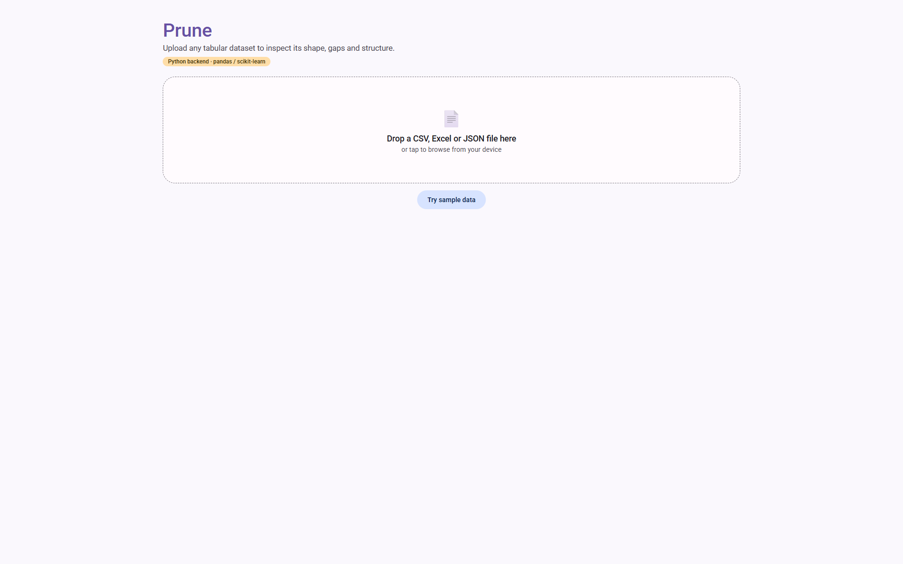
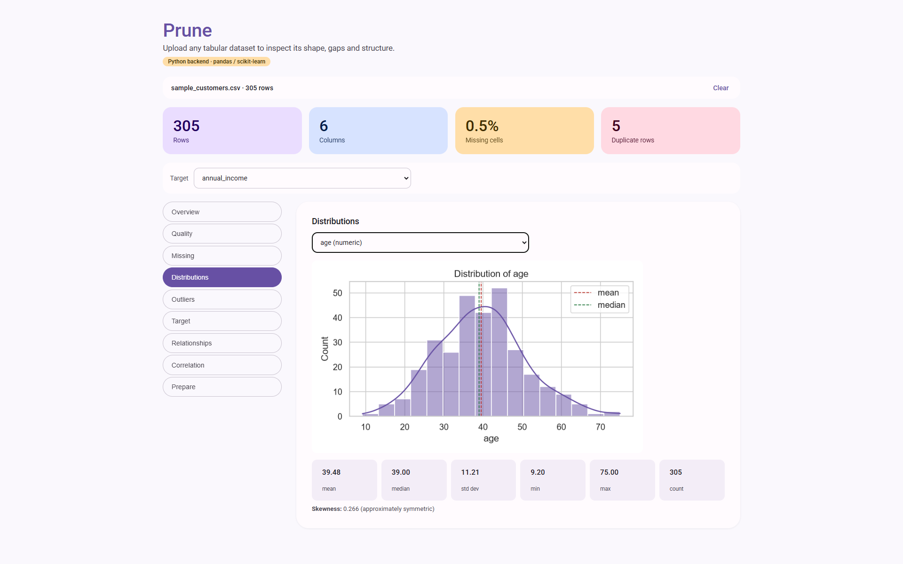
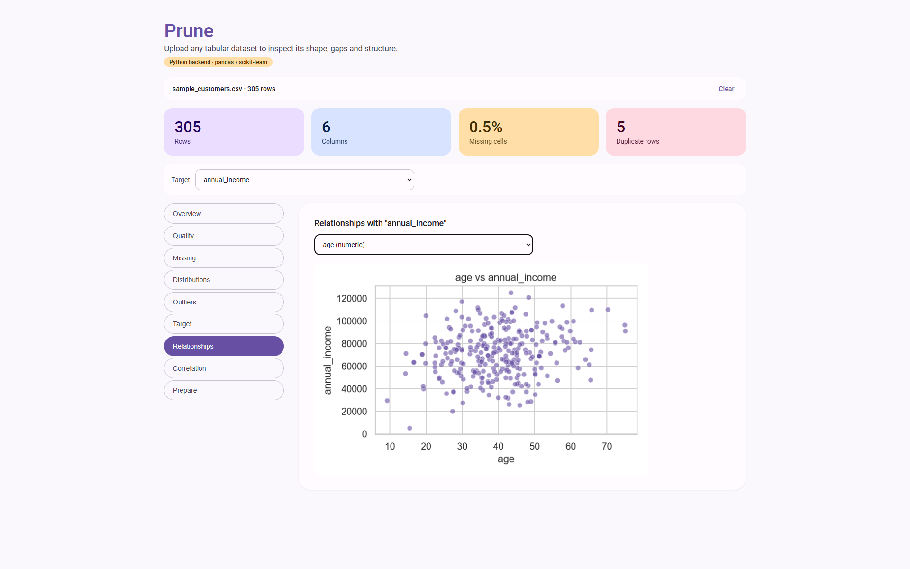

# Prune

**Prune** is a local, single-page web app for exploring and preprocessing tabular
datasets. Upload a CSV, Excel, or JSON file and it walks through the same steps
you'd normally do by hand in a Jupyter notebook — overview, missing values,
duplicates, outliers, distributions, correlations, encoding, scaling, and
train/val/test splitting — all through a clean, tappable UI.

Unlike a purely client-side tool, Prune's analysis is powered by a **real
Python backend**. Every chart, statistic, and transformation is computed
server-side with `pandas`, `numpy`, `scikit-learn`, `scipy`, and `matplotlib` —
the browser is just a thin client that renders the results. This means the
numbers you see are produced by the exact same libraries you'd use in a
notebook, not a JavaScript re-implementation.



---

## Why a Python backend?

The original version of this tool ran entirely in the browser. That was fine
for basic stats, but it meant re-implementing pandas/scikit-learn behavior in
JavaScript by hand — skewness, IQR outlier bounds, one-hot encoding, scalers,
`train_test_split`, etc. — with no guarantee it matched Python's actual output.

Prune now sits **in the same folder as `dataset_preprocessor.ipynb`** and
reuses that notebook's logic directly:

- `preprocessing_lib.py` is a straight port of the notebook's functions
  (`dataset_overview`, `missing_data_report`, `detect_outliers_iqr`,
  `build_preprocessing_pipeline`, `split_data`, `save_pipeline`, ...).
- `backend.py` is a small Flask app that exposes those functions as JSON/image
  API endpoints and serves the front end.
- `dataset_preprocessor_gui.html` is the browser UI. It no longer computes
  anything itself — it just calls the API and renders what comes back
  (including server-rendered matplotlib/seaborn PNGs).

So the HTML file **requires the Python backend to be running** — it is not a
standalone file anymore.

---

## Project structure

```
dataset_preprocessor_app/
├── backend.py                     # Flask server + REST API
├── preprocessing_lib.py           # Ported notebook logic (pandas/sklearn/matplotlib)
├── dataset_preprocessor_gui.html  # Front end (served by Flask)
├── dataset_preprocessor.ipynb     # Original notebook (reference / same folder)
├── requirements.txt
└── images/
```

> Keep `dataset_preprocessor_gui.html` and `dataset_preprocessor.ipynb` in the
> **same folder** as `backend.py` — the server serves the HTML file directly
> from disk at startup.

---

## Getting started

```bash
cd dataset_preprocessor_app
pip install -r requirements.txt
python backend.py
```

Then open **http://127.0.0.1:5000** in your browser.

Click **"Try sample data"** to load a small synthetic customer dataset, or
drop in your own CSV / Excel / JSON file.

---

## What you can do

| Tab | What it does |
|---|---|
| **Overview** | Row/column counts, dtypes, unique values, missing % per column |
| **Quality** | Duplicate rows, invalid/inconsistent values, rare & inconsistent categories |
| **Missing** | Missing-value heatmap + per-column counts (`matplotlib`) |
| **Distributions** | Histogram/KDE for numeric columns, bar chart for categorical, mean/median/std/skewness |
| **Outliers** | IQR boxplot or Z-score flagging, per numeric column |
| **Target** | Class balance (classification) or skew/outliers (regression) for your chosen target |
| **Relationships** | Scatter/boxplots between any feature and the target |
| **Correlation** | Correlation heatmap, redundant-feature pairs, basic data-leakage flags |
| **Prepare** | Fill/drop missing values, extract date & text features, encode (one-hot/ordinal), scale (standard/min-max/robust), log-transform skewed columns, split into train/val/test, fit a real `sklearn.ColumnTransformer`, and export |

### Distributions tab


### Relationships tab


---

## Exporting your work

From the **Prepare** tab you can download:

- `processed_dataset.csv` — the current working copy
- `train.csv` / `val.csv` / `test.csv` — after splitting
- **`preprocessing_pipeline.joblib`** — the fitted `sklearn.ColumnTransformer`
  (once you click "Fit sklearn preprocessing pipeline"), so the exact same
  transformations can be applied to new data later with `joblib.load(...)`
- If no pipeline has been fitted yet, this instead downloads a
  `preprocessing_pipeline.json` log of every step you applied (fills, drops,
  encodings, scaling, splits) in order

---

## API reference (for reuse in other tools)

All endpoints are served by `backend.py` and return JSON (or a CSV/joblib file
for the `/api/download/*` routes). A few examples:

```
POST /api/load                     multipart file upload → dataset summary
POST /api/sample                   loads the built-in sample dataset
GET  /api/overview                 column-by-column summary
GET  /api/missing                  missing-value report + chart
GET  /api/quality                  duplicates, invalid values, categorical quality
GET  /api/distribution?col=X       histogram/bar chart + stats for one column
GET  /api/outliers?col=X&method=   IQR or Z-score outlier detection
GET  /api/target?col=X             target variable analysis
GET  /api/relationship?col=X&target=Y
GET  /api/correlation              correlation matrix, redundancy, leakage flags
POST /api/prepare/fill_missing     {column, strategy, constant?}
POST /api/prepare/encode           {column, method: "onehot"|"ordinal"}
POST /api/prepare/scale            {method: "standard"|"minmax"|"robust"}
POST /api/prepare/split            {test_size, val_size}
GET  /api/download/processed
GET  /api/download/pipeline
```

The app keeps state in memory (it's a local, single-user tool, same mental
model as a notebook's global `df`) — there's no database and no login.

---

## Requirements

- Python 3.9+
- See `requirements.txt` (Flask, pandas, numpy, scikit-learn, scipy,
  matplotlib, seaborn, joblib, openpyxl)

## Notes / limitations

- This is designed to run **locally on your machine** — it is not hardened
  for multi-user or public deployment (no auth, in-memory global state).
- Parquet upload is supported by `preprocessing_lib.load_data`, but you'll
  need `pyarrow` or `fastparquet` installed for it to work.
- Restarting `backend.py` clears the loaded dataset and pipeline log.
- 
